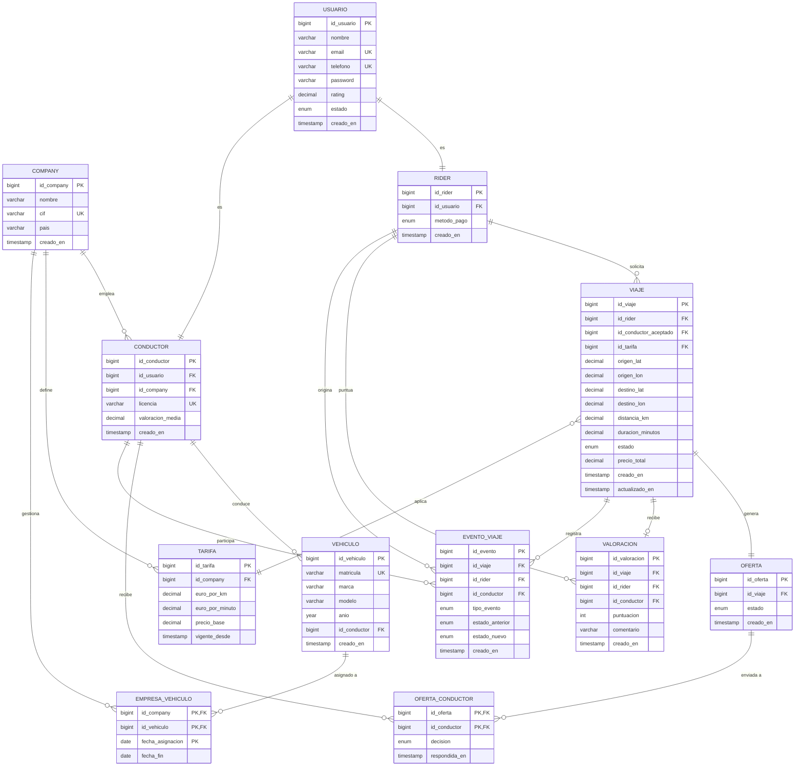

# DESIGN

> En el siguiente md va encontrar explicadas todas las decisiones de diseño que se tomaron para construir la base de datos para esta practica.

---

## Diagrama de entidad relación

---

## Que tablas hemos usado y porque

### 1. USUARIO

Esta tabla la hemos creado por que en la plataforma hay dos tipos de usuarios, el rider y el conductor. Ambos comparten varios campos en comun como **nombre, email, telefono y contraseña**. En lugar de repetir estos campos en dos tablas diferentes, hemos implementado **USUARIO**. Tanto Rider como Conductor tienen una relacion `es(1:1)` con Usuario, heredando los campos comunes. Tambien hemos implementado el campo `estado` para poder bloquear o desactivar una cuenta sin borrarla de la base de datos. El campo `rating` representa la puntuación general del usuario.

### 2. RIDER

Esta es una de las tablas principales del sistema, representa a la persona o cliente que solicita un viaje de un punto A a un punto B. Hereda los datos de `Usuario` a traves de `id_usuario` y añade el campo `metodo_pago` que es especifico del Rider quien es el que paga un viaje.

Rider tiene una relación `solicita(1:n)` con `viaje` ya que un **rider** puede realizar múltiples viajes a lo largo del tiempo, guardando en `viaje` el id del rider como clave foránea.

---

### 3. CONDUCTOR

Esta tabla representa al conductor que acepta las ofertas de viajes y lleva al rider a su destino. Al igual que la tabla Rider, esta hereda los datos personales de `Usuario` a través de id_usuario. Añade campos especificos como la licencia de conducir y la valoracion_media que se actualiza cada vez que un rider puntúa un viaje.

Conductor tiene 4 relaciones más:

- Tiene una relación `recibe(N:N)` con Oferta ya que una oferta puede ser enviada a muchos conductores y un conductor puede recibir muchas ofertas.
- Tiene una relación `conduce(1:N)` con vehículo ya que un conductor puede tener varios vehiculos asignados a lo largo del tiempo.
- Tiene una relacion con Viaje en donde guardamos el id del conductor que aceptó la oferta en el campo `id_conductor_aceptado`.
- Pertenece a una Company y guarda el `id_company` como clave foránea.

---

### 4. COMPANY

Esta tabla respresenta las empresas. Existe por que todos los conductores tienen que pertenecer a una empresa. En esta guardamos el nombre, CIF, y país de origen de la compañía. Tiene una relación con Vehículo por que en este tipo de plataformas los coches suelen ser propiedad de las empresas, no de los conductores, esto esta representado en la tabla intermedia `empresa_vehiculo`.  

---

### 5. VEHÍCULO

Los conductores necesitan un vehículo para transportar a los riders. La relación entre conductor y vehículo es `(1:N)` ya que un conductor puede tener varios vehículos asignados a lo largo del tiempo. Adicionalmente está relacionado con `Company` a través de `empresa_vehiculo` porque el vehículo pertenece a la empresa.

---

### 6. TARIFA

Esta tabla ha sido creada con el motivo de tener los precios separados del resto del sistema. Cada **Company** define su propia tarifa con tres componentes: un `precio_base` fijo al inicio de cada viaje, un coste por kilómetro y un coste por minuto. La relación con **Company** es `(1:N)` ya que un **Company** puede tener múltiples tarifas a lo largo del tiempo debido al campo `vigente_desde`. Esto permite tener un historial de los precios y los cambios que se hagan a lo largo del tiempo sin afectar viajes que ya se hayan realizados. Cada viaje referencia la tarifa que esta vigente en el momento de su creación. 

---

### 7. VIAJE

`Viaje` es la entidad central del sistema, representa el trayecto solicitado por un rider de un punto A a un punto B. La hemos creado para registrar toda la información del trayecto: coordenadas, estado, duración, distancia y precio final, siendo el nexo entre el rider, el conductor y la tarifa aplicada.

---

### 8. OFERTA

Cuando un rider solicita un viaje el sistema genera una oferta que se envía a todos los conductores activos. En esta tabla guardamos el estado de esa oferta y el viaje al que pertenece. La relación con **Viaje** es `(1:1)` ya que cada viaje genera exactamente una oferta.

---

### 9. OFERTA_CONDUCTOR

Esta es la tabla intermedia que resulta de la relación `(N:N)` entre oferta y conductor. Cuando un rider solicita un viaje, el sistema crea una oferta y la envia a todos los conductores que esten activos, insertando una fila en esa tabla por cada condcutor con el campo `decision = 'pendiente'`. El primer conductor que acepta la oferta, inicia una transacción que actualiza su fila en el campo de `decision` a `decision = 'aceptada'`, se rechaza automáticamente al resto. Para poder garantizar que nunca haya dos conductores con el campo `decision = 'aceptada'` para una misma oferta, hemos implementado un trigger BEFORE UPDATE, este lanza un error si se intenta aceptar una oferta que ya ha sido aceptada previamente. 

---

### 10. VALORACION

Esta tabla recoge la puntuacion que un rider le da a un conductor tras finalizar un viaje. La relacion con viaje tiene un `UNIQUE KEY` sobre `id_viaje` garantizando que sólo puede existir una valoración por viaje. La puntuación está entre un rango entre 1 y 5 mediante un `CHECK constraint`. Tras cada inserción de valoración, se actualiza el campo de `valoracion_media` del cconductor correspondiente. La tabla también indexa `id_conductor` e `id_rider` para acelerar las consultas de métricas de rendimiento por **Conductor** y por **Company**.

---

### 11. EMPRESA_VEHICULO

Esta tabla resulta de la relacion N:N entre company y vehiculo. Un vehiculo puede estar asignado a diferentes empresas a lo largo del tiempo y una empresa puede gestionar multiples vehiculos simultaneamente. La Primary Key esta compuesta por id_company, id_vehiculo y fecha_asignacion, esto permite registrar reasignaciones que puedan haber a lo largo del tiempo sin perder un historial. Cuando el campo fecha_fin es NULL, quiere decir que la asignacion esta vigente actualmente, esto permite filtrar de forma facil y rapida los vehiculos que hay activos en las empresas.

---

## Historial y auditoría

Para cubrir el requisito de historial y auditoría básica de operaciones hemos creado la tabla `evento_viaje`, que actúa como un log inmutable de todos los cambios de estado de cada viaje. Cada vez que un viaje transiciona de estado se inserta una fila nueva con el estado anterior, el estado nuevo, el actor responsable (rider o conductor) y el timestamp exacto. Esto nos permite reconstruir la línea de tiempo completa de cualquier viaje y detectar anomalías como viajes que nunca salen de `solicitado` o cancelaciones repetidas de un mismo rider.

## ÍNDICES

Adicional a los índices que crea MySQL para las claves primarias y únicas, hemos optado por implementar índices adicionales en las columnas que pueden ser mas usadas en consultas para filtrar, joins y ordenar. 

- `idx_viaje_estado`: para filtrar viajes por estado, que es la operación más frecuente en la operativa del sistema.
- `idx_viaje_rider`: para consultar el historial de viajes de un rider concreto.
- `idx_viaje_conductor_aceptado`: para buscar los viajes de un condcutor.
- `idx_viaje_creado_en`: para filtrar y ordenar por fecha.
- `idx_valoracion_conductor`: para calcular la valoración media de un conductor sin calcular sobre toda la tabla. 
- `idx_valoracion_rider`: para consultar el historial de valoraciones de un rider.
- `idx_evento_viaje`: para recuperar todos los eventos de un viaje específico.

## Triggers

Hemos implementado dos triggers en el sistema:
- `trg_viaje_update`: se ejecuta antes de cualquier consulta UPDATE en la tabla **Viaje** y actualiza el campo `actualizado_en` con el timestamp actual. Así siempre sabemos cuándo fue la última vez que se modificó un viaje sin tener que hacerlo manualmente en cada query.

- `trg_oferta_conductor_unica_aceptacion`: se ejecuta antes de cualquier consulta UPDATE en `oferta_conductor`. Si alguien intenta poner - `decision = 'aceptada'` en una oferta que ya tiene otro conductor con ese campo, el trigger lanza un error y la operación se cancela. Esto garantiza que nunca haya dos conductores aceptando el mismo viaje al mismo tiempo. 

## Concurrencia

Uno de los aspectos mas importantes del sistema es que se pueda garantizar que cuando varios conductores intentan aceptar la misma oferta al mismo tiempo, solo uno de ellos pueden quedar con esta. Para resolver esto usamos **SELECT ... FOR UPDATE** dentro de una transaccion antes de actualizar la decision del conductor. 
Lo que hace FOR UPDATE es bloquear la fila de ese conductor en la tabla `oferta_conductor` para que ninguna otra sesion pueda modificarla hasta que termine la transaccion. Si dos conductores intentan aceptar la misma oferta al mismo tiempo, el segundo tendra que esperar a que el primero termine y cuando sea su turno vera que la oferta ya ha sido aceptada.

Adicionalmente hemos implementado el trigger `trg_oferta_conductor_unica_aceptacion` que actúa como otro mecanismo de seguridad. Este ayuda a garantizar que aunque se llegue al UPDATE, no se podrán quedar dos conductores con `decision = 'aceptada'` para una misma oferta

## Dashboard EXPLICACION:

El dashboard de nuestra aplicación Ride_halling lo hemos dividido en dos secciones especializadas: uno para la monitarización de la bases de datos y otro para las métricas de negocio.
A su vez, hemos integrado Grafana la cual nos muestra en timpo real el estado técnico de la base de datos sin que la tengamos que ejecutar manualmente. Pero esas sólo cubren los datos que extrae el propio export y pasa a Grafana gracias a Prometheus pero igualmente se puede jecutar manualmente todo el dashboard con nuestras queries que tienen datos de negocio que no aparecen en Grafana

### 1.Monitorizacion de la base de datos:

Este dashboard recoge métricas clave para comprobar que la base de datos está funcionando correctamente. Procederemos a listarlas y explicar porque son importantes:

- Métricas de conexiones: las utilizamos para ver si llegamos al límite de conexiones simultaneas que podemos soportar antes de rechazar la conexión de clientes. Con `Threads_connected` observamos cuantas conexiones hay abiertas ahora mismo. A su vez con  `max_used_connections` observamos cual es el pico máximo de conexiones que hemos tenido simultáneamente que lo complementamos con `Connection:error_max_connection` para comprobar si hemos rechazado alguna conexión, siempre debe ser 0 porque sino significa que hemos rechazado conexiones.

- Queries: estas están enfocadas en analizar si la base de datos se utiliza más en escritura o lectura. Ademas con `Slow_queries` podemos saber si las consultas a la base de datos están tardando mas de lo necesario o no. Adicionalmente para que fuera más eficiente decidimos añadir `performance_schema.events_statements_summary_by_digest` ya que agrega automáticamente todas las queries ejecutadas con la media de las latencias, tiempo máximo y total de queries. Tras ello las ordeno por `SUM_TIMER_WAIT` para cuales son las consultas que acumulan más tiempo.
- Buffer pool de InnoDB: esta esta enfocada a medir sobre todo el rendimiento de la caché ya que en caso de que la caché sea demasiado pequeña y no tenga los datos obliga a traerlos del disco constantemente, haciendo así que se reduzca la eficiencia de la base de datos. Para tenerlo controlado utilizamos el calculo del `hit_ratio` porque consideramos que la memoria funciona bien siempre que esté por encima del 95%.
- Métricas de bloqueos: como ridehailing es una plataforma de transporte hemos considerado que es de gran importancia controlar correctamente los bloqueos, ya que si dos conductores cogen al mismo cliente entonces significa que tuvimos un fallo nosotros. Por ello utilizamos `Innodb_row_locks_waits` para el tiempo medio de espera entre transacciones y `Innodb_deadlocks` que son las que son rechazadas, estas deben ser siempre 0. Si sube significa que están mal ordenadas y hay que matar una de ellas.
- Indices : Hemos añadido un par de consultas de índices ya que en caso de que se detecte que un índice no se esta utilizando es mejor eliminarlo ya que no aporta nada, y en caso de que haya dos redundantes poder detectarlos para corregirlos.

### 2.Dashboard de métricas de negocio
Este segundo dashboard esta pensado para mostrar estadísticas de la operativa de la base de datos. Por ejemplo la cantidad de viajes por hora, la distribución de los estados, etc.
Pasaremos a explicar los elegidos:
- Viajes por hora: agrupamos los viajes de la última semana por horas y días. Decidimos desarrollarlo a 7 días porque para una aplicación como ride-hailing tendría sentido que se quisiera motorizar semanalmente la cantidad de viajes y cuáles son sus horas pico.
- Distribución de estados: para ver si los viajes pasan de estado solicitado a estado aceptado. Tiene sentido ya que en caso de que se detectara que hay muchos viajes en estado solicitado que no cambian significa que no hay conductores suficientes.
- Ofertas aceptadas/rechazadas/pendientes: sobre la oferta del conductor muestra el porcentaje de rechazos, aceptaciónes y pendientes sobre los pedidos. Sirve para analizar si las condiciones del viaje a lo mejor no son buenas para el conductor y por ello lo rechazan o lo aceptan.
- Tasa de aceptación por conductor y company: sirve para ver la cantidad de ofertas que acepta un conductor y la cantidad de ofertas que acepta en conjunto una company.
- Métricas globales y top de conductores: mostramos las medias globales de precio y distancia y un ranking de los 10 conductores más productivos.

## BACKUP
Para desarrollar el backup hay que tener en cuenta que estamos desarrollando una plataforma de ride-hailling que opera en tiempo real y tiene eventos con consecuencias económicas en caso de fallo, ya sea un pago, una oferta aceptada o un viaje que nunca pasa de en curso a finalizado.
Con todo esto en mente el equipo decidió definir un RPO de 1 hora y un RTO de 4 horas. Significando que aceptamos el riesgo de perder 1 hora de datos de viajes y 4 horas de tiempo máximo para volver a estar con la plataforma operativa. 
Decidimos que fuera un backup lógico ya que consideramos que como plataforma hecha para un trabajo de estudiantes no contamos con una cantidad muy grande de datos y asi podemos tener un archivo .sql portable para funcionar en cualquier momento, siendo legible y verificable y permitiendo que hagamos una restauración con un solo comando.
Dentro del comando que utilizamos para la restauración cada línea tiene su porque:
--single-transaction sirve para realizar un snapshot coherente en el mismo instante en el que se ejecute sin bloquear ninguna tabla.
--routines, --triggers, --events: sirve para asegurar que todo los procedimientos, eventos o triggers sean capturados y no se olviden.
--set-gtid-purged=OFF : ya que sin esta opción el archivo .sql integra datos que pueden romper el restore.
Para comprobar tras la restauración implementamos un bloque de verificación de tablas, conteo de filas por tabla y una consulta de negocio de viajes de los últimos 7 días. Viendo si los datos que nos muestren son coherentes decidimos si se realizo bien la restauración.
Además, añadimos un backup automatico que se ejecuta cada hora ya que en caso de que se tenga que dejar a un backup manual no tendría sentido. Y para que no se acumulen los backups hacemos que los backups con mas de 5 días se vayan eliminado.  

