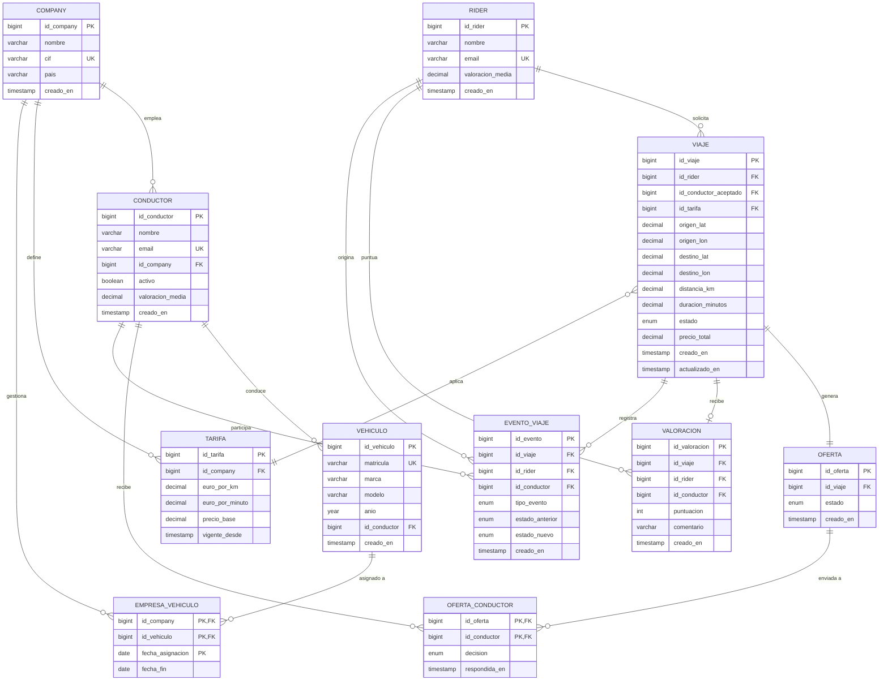

# DESIGN

> En el siguiente md va encontrar explicadas todas las decisiones de diseño que se tomaron para construir la base de datos para esta practica.

---

## Diagrama de entidad relación

---

## Que tablas hemos usado y porque

### 1. RIDER

Esta es una de las tablas principales ya que en el enunciado indica explicitamente que el rider es la persona que va ser llevada de un punto A a un punto B que tiene una relación de `es(1:1)` directa con usuario ya que en esta plataforma tenenemos 2 tipos de usuarios, tambien se ha hecho para mantener los roles especificos de cada usuario separados, como `metodoPago` que es el que decidirá el usuario y `ultimoViaje` que va a guardar como su propio nombre indica el ultimo viaje realizado con el usuario.

Rider tiene una relación `solicita(1:n)` con `viaje` ya que un **rider** puede realizar múltiples viajes a lo largo del tiempo, guardando en `viaje` el id del rider como clave foranea.

---

### 2. CONDUCTOR

Esta tabla ha sido creada porque va ser la entidad encargada de aceptar la oferta y llevar al rider, al igual que rider esta mantiene tambien una relación `es(1:1)` con usuario ya que es el otro tipo de usuario.

Conductor tiene 4 relaciones más:

- La principal como es el encargado de aceptar las ofertas que genera el sistema cuando un usuario solicita un viaje este tiene una relación `recibe(n:n)` con oferta ya que una oferta puede ser lanzada a muchos conductores.
- Como los conductores tiene que transportar a los riders con algún vehículo existe una relación con vehiculo la cual es `conduce(1:1)` donde solo un coche puede ser conducido por un conductor.
- Como queremos guardar en los registros que conductor ha realizado que viaje tenemos una relación `realiza(1:n)` donde guardamos en viaje el id del conductor que previamente ha aceptado la oferta.
- Como todos los conductores pertenencen a una company existe una relación con company.

---

### 3. USUARIO

Esta tabla ha sido creada para facilitar el proceso de creación de multiples usuarios, ya que hay muchos datos comunes entre ambos usuarios que se guardan en esta tabla luego los usuarios heredan de esta tabla esos atributos mediante una relación `es(1:1)`.

---

### 4. COMPANY

El motivo de creación de esta tabla es que todo los conductores deben pertenecer a una company, en company guardaremos datos como el nombre de la compañia, el cif y el país de origen de la compañia, hemos añadido otra relación, ya que normalemente todos los vehiculos de empresas que se dedican a llevar a personas los vehiculos que usan los conductores suelen ser de estas compañias, esta es `1:n` porque una compañia puede tener multiples vehículos.

---

### 5. VEHÍCULO

Al existir la entidad conductor estos deben tener algun vehículo donde llevar a los riders que solcitan el viaje, luego la relación que existe entre conductor y vehiculo es `1:1` ya que solo un coche puede ser concucido al mismo tiempo por un conductor y luego tambien esta relacionado con company por que el coche peternece a la compañia y no al conductor.

---

### 6. TARIFA

Esta tabla ha sido creada con el motivo de tener los precios aislados del resto del sistema. Cada company define su propia tarifa con tres componentes: un precio_base fijo al inicio de cada viaje, un coste por kilometro y un coste por minuto. La relación con company es 1:N ya que un company puede tener multiples tarifas a lo largo del tiempo debido al campo vigente_desde. Esto permite tener un historial de los precios y los cambios que se hagan a lo largo del tiempo sin afevttar viajes que ya se hayan realizados. Cada viaje referencia la tarifa que esta vigente en el momento de su creacion. 

---

### 7. VIAJE

`viaje` es la entidad central del sistema, representa el trayecto solicitado por un rider de un punto A a un punto B. La hemos creado para registrar toda la información del trayecto: coordenadas, estado, duración, distancia y precio final, siendo el nexo entre el rider, el conductor y la tarifa aplicada.

---

### 8. OFERTA

Los viajes generan ofertas que son lanzadas a todos los conductores y estas solo pueden ser aceptadas por un conductor, en oferta guardamos información como el estado, el id del viaje que ha creado las ofertas, la hora que ha sido creada, el estado si ha sido aceptada o no.

---

### 9. OFERTA_CONDUCTOR

Esta es la tabla intermedia que resulta de la relacion N:N entre oferta y conductor. Cuando un rider solicita un viaje, el sistema crea una oferta y la envia a todos los conductores que esten activos, insertando una fila en esa tabla por cada condcutor con el campo decision=pendiente. El primer conductor que acepta la oferta, inicia una transaccion que actualiza su fila en el campo de decision a decision = aceptada, se rechaza automaticamente al resto. Para poder garantizar que nunca haya dos conductores con el campo decision = aceptada para una misma oferta, hemos implementado un trigger BEFORE UPDATE, este lanza un error si se intenta aceptar una oferta que ya ha sifo aceptada previamente. 

---

### 10. VALORACION

Esta tabla recoge la puntuacion que un rider le da a un conductor tras finalizar un viaje. La relacion con viaje tiene un UNIQUE KEY sobre id_viaje garantizando que solo puede existir una valoracion por viaje. La puntuacion esta entre un rango entre 1 y 5 mediante un CHECK constraint. Tras cada insercion de valoracion, se actualiza el campo de valoracion_media del cconductor correspondiente. La tabla tambien indexa id_conductor e id_rider para acelerar las consultas de metricas de rendimiento por conductor y por company.

---

### 11. EMPRESA_VEHICULO

Esta tabla resulta de la relacion N:N entre company y vehiculo. Un vehiculo puede estar asignado a diferentes empresas a lo largo del tiempo y una empresa puede gestionar multiples vehiculos simultaneamente. La Primary Key esta compuesta por id_company, id_vehiculo y fecha_asignacion, esto permite registrar reasignaciones que puedan haber a lo largo del tiempo sin perder un historial. Cuando el campo fecha_fin es NULL, quiere decir que la asignacion esta vigente actualmente, esto permite filtrar de forma facil y rapida los vehiculos que hay activos en las empresas.

---

## Historial y auditoría

Para cubrir el requisito de historial y auditoría básica de operaciones hemos creado la tabla `evento_viaje`, que actúa como un log inmutable de todos los cambios de estado de cada viaje. Cada vez que un viaje transiciona de estado se inserta una fila nueva con el estado anterior, el estado nuevo, el actor responsable (rider o conductor) y el timestamp exacto. Esto nos permite reconstruir la línea de tiempo completa de cualquier viaje y detectar anomalías como viajes que nunca salen de `solicitado` o cancelaciones repetidas de un mismo rider.